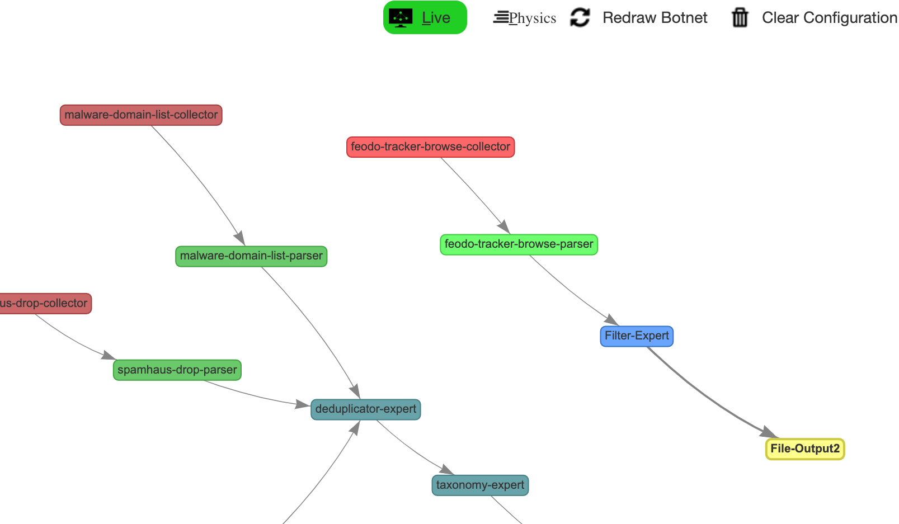
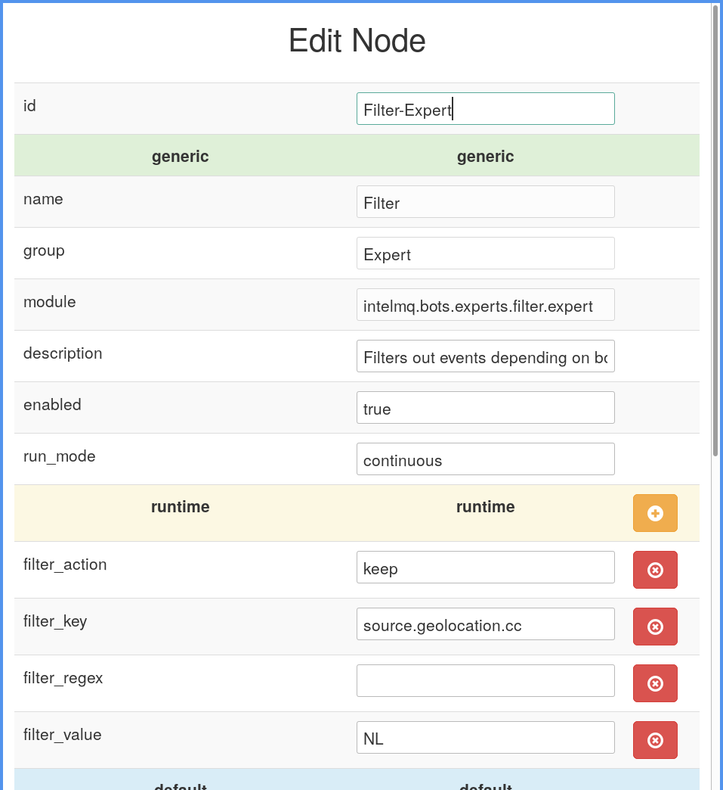
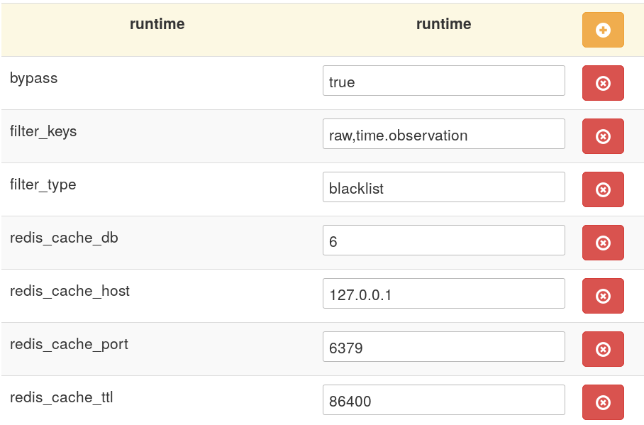
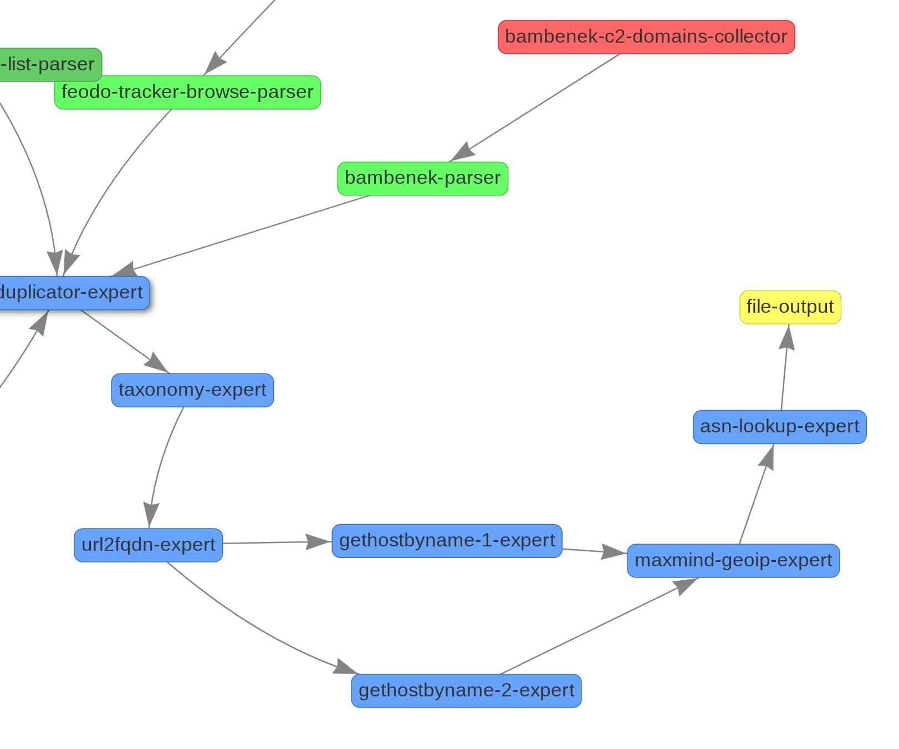

# Lesson 2: Getting started


## Familiarization with the VM: makeing sure it works

Before we start, we need to make sure everything works.

* How to read the tutorial web page on the VM
* Does the internet connection work in the VM?
* How to reset the VM in case something goes wrong?


Concerning access to the VM from your host system: this depends on how you configured your VirtualBox VM. The default network setup in VirtualBox is "NAT". Meaning, your VM is NATed to your PC. That means, your PC can reach the VM via port forwarding. The default config in the VM image (.ova) is that we forward the port 8080 on your PC/laptop to the VM port 80. See the screenshot below.


This being said, your setup might be slightly different (you might have decided to bridge and the VM received an IP address via DHCP. Please check the IP address inside of your VM in this case).

We now assume, you followed the default approach of the VM and used the portforwarding localhost:8080 -> VM:80 approach.
Now go to [http://localhost:8080/](http://localhost:8080/).

You should see a small website like: 


### **IMPORTANT**: *copy & paste support*

We **highly** recommend, to ssh into the VM from your favorite terminal program, like so (password `user`):
```bash

ssh -p 2222 user@localhost
```


This allows you to follow the tutorial with copy & pasting the answers (in case you get lost). The shell window in the VM itself does not support copy & pasting. Meaning, you will have to type long commands.

### **Network connectivity**
Next, we need to make sure, that the VM can download data from the Internet.
Please execute a `ping 8.8.8.8` or similar and make sure that DNS resolving works:

```bash
ping www.google.com
```

And finally, if you get lost, the VM can be reset so that you have a clear baseline to start from.
You can either create a [snaptshot of the VM now](https://www.virtualbox.org/manual/ch01.html#snapshots), or you can call the `reset-intelmq.sh` script from within the VM's command line (after starting the script, no IntelMQ process should be running anymore, so you might have to restart the processes again if needed).

### Updating to the latest tutorial

Before starting with the tutorial, apply some updates to the VM:

```bash
> tutorial-update.sh
> ./intelmq-tutorial/update-vm.sh
```

### Working on the shell

IntelMQ uses it's own unprivileged user `intelmq`. Always work as this user, otherwise you might screw up some file permissions!

To change the user, for example run:
```bash
sudo -iu intelmq
```

## Familiarization - where can I find what? A short walk-through the directory structure

After making sure that we can reach the VM from the host (your PC or laptop), we can take a look at the VM's setup.

But first let us say that the documentation is pretty solid by now. So if you feel lost - apart from this tutorial, you can find 
the User Guide and the Developers Guide [on readthedocs](https://intelmq.readthedocs.org).

### The directory structure and command line tools

IntelMQ knows multiple ways of getting installed: .deb packages, .rpm, or via pip or via git clone. Also, we distinguish between a production installation and a development installation.

In our case, a production installation has been chosen as installation method (if you had a development installation, all IntelMQ-installation related files would be found in `/opt/intelmq` for a better overview).

Directory layout:

* `/etc/intelmq/`: The configuration files.
* `/var/lib/intelmq/`: Data of IntelMQ and it's bots:
* `/var/lib/intelmq/bots/`: For example configuration files of certain bots, local lookup data and output files.
* `/var/log/intelmq/`: The log files and dumped data.
* `/var/run/intelmq/`: The internal PID-files.


#### Task: Log file location

Where can I find the log files?

<details>
  <summary>Click to see the answer.</summary>

You can find all log files in `/var/log/intelmq/`. Initially, it should look something like this (because we did not start anything yet):

```bash
intelmq@malaga:~$ ls -al /var/log/intelmq/
total 8
drwxr-xr-x 2 intelmq intelmq 4096 Jan 30 07:07 .
drwxr-xr-x 5 intelmq intelmq 4096 Jan 23 17:09 ..
-rw-r--r-- 1 intelmq intelmq    0 Jan 30 07:07 intelmqctl.log
```

</details>


### intelmqctl

IntelMQ comes with a command line tool, called `intelmqctl`. It is the work-horse for interacting with IntelMQ. Therefore, we would like to make you familiar with it first. As in many other command line tool (compare for example the `apache2ctl` tool), these commands are provided:

* `intelmqctl start`
* `intelmqctl stop`
* `intelmqctl status`
* `intelmqctl reload`: schedules re-reading and applying configuration without stopping
* `intelmqctl restart`

These commands take a `bot-id` as optional parameter. If not given, the command is applied to all configured bots.

Other important commands:

* `intelmqctl list queues`: Show configured queues and their sizes.
* `intelmqctl check`: Runs some self-check on IntelMQ and supported bots.
* `intelmqctl clear`: Clears the queue given as parameter.
* `intelmqctl log`: Shows the last lines of the bot given as paramter.

The following commands will be described later:
* `intelmqctl enable`
* `intelmqctl disable`

You can get help with `intelmqctl -h` or `intelmqctl --help`, also available for sub-commands. Most subcommands also have auto-completion.

A complete list of  available commands can be found in the [intelmqctl documentation](https://intelmq.readthedocs.io/en/maintenance/user/intelmqctl.html)

## Default configuration

This tutorial (and in fact every default installation of IntelMQ) comes with a very basic default configuration: some basic bots and public feeds.
By *configuration* we mean a runtime.yaml file containing the *runtime parameters* for all bots (for example API-keys, database names, database users, mail server address, etc.) and their *pipeline* configuration which describes which bot is connected to which other bot.

In our case, the config consists of:

* 3 collectors and their respective parsers with public feeds.
* Some experts providing de-duplication and basic lookups, including a round-robin "load-balanced" bot.
* A file output bot writing to `/var/lib/bots/file-output/events.txt`.

In the beginning of the tutorial we will work with this configuration, afterwards we will set up our own workflows and add new bots and connections (pipelines).

### Task: Start a collector and look at it's log

Start the `spamhaus-drop-collector` and verify in the logs that it successfully collected the feed. Then stop the bot again.

<details>
    <summary>Click to see the answer.</summary>

The bot-id for the  `spamhaus-drop-collector` is... you might have guess it...  `spamhaus-drop-collector`.

* Here is how you start it: `intelmqctl start spamhaus-drop-collector`
* Here is how you look at its logs:
  * `intelmqctl log spamhaus-drop-collector` or (even simpler) `tail /var/log/intelmq/spamhaus-drop-collector.log`  should show you the log file:
```
2020-01-24T11:15:39.023000 - spamhaus-drop-collector - INFO - HTTPCollectorBot initialized with id spamhaus-drop-collector and intelmq 2.1.1 and python 3.7.3 (default, Apr  3 2019, 05:39:12) as process 6950.
2020-01-24T11:15:39.023000 - spamhaus-drop-collector - INFO - Bot is starting.
2020-01-24T11:15:39.024000 - spamhaus-drop-collector - INFO - Bot initialization completed.
2020-01-24T11:15:39.024000 - spamhaus-drop-collector - INFO - Downloading report from 'https://www.spamhaus.org/drop/drop.txt'.
2020-01-24T11:15:39.147000 - spamhaus-drop-collector - INFO - Report downloaded.
2020-01-24T11:15:39.151000 - spamhaus-drop-collector - INFO - Idling for 3600.0s (1h) now.
```

(note that your output might vary slightly).

You can see that the INFO log level shows information on startup, the fetched URL and that the bots is then sleeping for one hour.

* Stopping the bot: `intelmqctl stop spamhaus-drop-collector`
</details>

### If something went wrong

This bot already downloads data from the Internet. If your internet connection does not work (ping www.google.com), then it can't download anything. 

### Lookup how many events are in the queue for a bot.

Every bot talks with other bots via **queues**. Queues are basically message queues in a MQ system (by default, IntelMQ uses Redis as MQ system). Messages are basically log lines which should get processed.

Next, we would like to start the `spamhaus-drop-parser` and look up how many events are waiting to be processed in the queue of the next bot (the `deduplicator-expert` in our initial configuration).

<details>
    <summary>Click to see the answer.</summary>

* `intelmqctl start spamhaus-drop-parser`
* `intelmqctl list queues -q`   # shows all non-empty queues:
```
deduplicator-expert-queue - 824
```
(your output might vary slightly).
</details>

## Simple input and output bots

So far, we can start and stop bots and check in their respective log files, if they did anything. We can also check how many messages are waiting in which queue. You will need these steps over and over again, especially if something breaks. The log files are your friend! Use them :)

Next, we will collect real abuse.ch data from the internet, parse it and send the output to a file.


### Task: Emit data with a file output bot and look at the output

Our default configuration has a number of bots which need to get started in order to have a full path between the Abuse.ch Feodo collector and the file output bot. You can see the paths between the bots which are configured by default in two ways:

  1. via the `/etc/intelmq/runtime.yaml` file
  2. via the IntelMQ manager. 

We will look at the manager in a minute.

First, please look at the the `/etc/intelmq/runtime.yaml` and identify the path the events are taking between the feodo collector and the ouput. Start each bot individually and observe the message queues and the status.

Next, check if the feodo collector indeed fetched all the data, passed it through the "botnet" and sent it to the file-output bot, which in turn wrote it to disk.

<details>
    <summary>Click to see the answer.</summary>

```bash
intelmqctl start feodo-tracker-browse-collector
intelmqctl start feodo-tracker-browse-parser
intelmqctl start deduplicator-expert
intelmqctl start taxonomy-expert
intelmqctl start url2fqdn-expert
intelmqctl start gethostbyname-1-expert
intelmqctl start gethostbyname-2-expert
intelmqctl start cymru-whois-expert
intelmqctl start file-output
```

Make sure the bots are indeed running and that they fetched something from the Internet and parsed it:

```bash
intelmqctl status
cat /var/log/intelmq/*feodo*.log
```

Output (your output might vary):
```
2020-01-27 12:30:54,901 - feodo-tracker-browse-collector - INFO - HTTPCollectorBot initialized with id feodo-tracker-browse-collector and intelmq 2.1.1 and python 3.7.3 (default, Apr  3 2019, 05:39:12) as process 9223.
2020-01-27 12:30:54,903 - feodo-tracker-browse-collector - INFO - Bot is starting.
2020-01-27 12:30:54,903 - feodo-tracker-browse-collector - INFO - Bot initialization completed.
2020-01-27 12:30:54,904 - feodo-tracker-browse-collector - INFO - Downloading report from 'https://feodotracker.abuse.ch/browse'.
2020-01-27 12:30:55,729 - feodo-tracker-browse-collector - INFO - Report downloaded.
2020-01-27 12:30:55,801 - feodo-tracker-browse-collector - INFO - Idling for 86400.0s (1d) now.
```
```
2020-01-27 12:31:00,989 - feodo-tracker-browse-parser - INFO - HTMLTableParserBot initialized with id feodo-tracker-browse-parser and intelmq 2.1.2.alpha.1 and python 3.7.3 (default, Apr  3 2019, 05:39:12) as process 9265.
2020-01-27 12:31:00,990 - feodo-tracker-browse-parser - INFO - Bot is starting.
2020-01-27 12:31:00,990 - feodo-tracker-browse-parser - INFO - Bot initialization completed.
2020-01-27 12:31:09,397 - feodo-tracker-browse-parser - INFO - Processed 500 messages since last logging.
...
2020-01-27 12:31:21,869 - feodo-tracker-browse-parser - INFO - Processed 500 messages since last logging.
```


And finally, we would like to take a look at its output: the output bot (which is by default the place where all events are sent to in our initial configuration) should show you the feodo events:

* `less /var/lib/intelmq/bots/file-output/events.txt`

Output:
```json
{"classification.taxonomy": "malicious code", "classification.type": "c2server", "feed.accuracy": 100.0, "feed.name": "Feodo Tracker Browse", "feed.provider": "Abuse.ch", "feed.url": "https://feodotracker.abuse.ch/browse", "malware.name": "heodo", "raw": "PHRyPjx0ZD4yMDE5LTEyLTEyIDAzOjM3OjMzPC90ZD48dGQ+PGEgaHJlZj0iL2Jyb3dzZS9ob3N0LzEyMC41MS44My44OS8iIHRhcmdldD0iX3BhcmVudCIgdGl0bGU9IkdldCBtb3JlIGluZm9ybWF0aW9uIGFib3V0IHRoaXMgYm90bmV0IEMmYW1wO0MiPjEyMC41MS44My44OTwvYT48L3RkPjx0ZD48c3BhbiBjbGFzcz0iYmFkZ2UgYmFkZ2UtaW5mbyI+SGVvZG8gPGEgY2xhc3M9Im1hbHBlZGlhIiBocmVmPSJodHRwczovL21hbHBlZGlhLmNhYWQuZmtpZS5mcmF1bmhvZmVyLmRlL2RldGFpbHMvd2luLmVtb3RldCIgdGFyZ2V0PSJfYmxhbmsiIHRpdGxlPSJNYWxwZWRpYTogRW1vdGV0IChha2EgR2VvZG8gYWthIEhlb2RvKSI+PC9hPjwvc3Bhbj48L3RkPjx0ZD48c3BhbiBjbGFzcz0iYmFkZ2UgYmFkZ2Utc3VjY2VzcyI+T2ZmbGluZTwvc3Bhbj48L3RkPjx0ZD5Ob3QgbGlzdGVkPC90ZD48dGQgY2xhc3M9InRleHQtdHJ1bmNhdGUiPkFTMjUxOSBWRUNUQU5UIEFSVEVSSUEgTmV0d29ya3MgQ29ycG9yYXRpb248L3RkPjx0ZD48aW1nIGFsdD0iLSIgc3JjPSIvaW1hZ2VzL2ZsYWdzL2pwLnBuZyIgdGl0bGU9IkpQIi8+IEpQPC90ZD48L3RyPg==", "source.allocated": "2008-03-20T00:00:00+00:00", "source.as_name": "VECTANT ARTERIA Networks Corporation, JP", "source.asn": 2519, "source.geolocation.cc": "JP", "source.ip": "120.51.83.89", "source.network": "120.51.0.0/16", "source.registry": "APNIC", "status": "Offline", "time.observation": "2020-01-27T11:30:55+00:00", "time.source": "2019-12-12T02:37:33+00:00"}
...
{"classification.taxonomy": "malicious code", "classification.type": "c2server", "feed.accuracy": 100.0, "feed.name": "Feodo Tracker Browse", "feed.provider": "Abuse.ch", "feed.url": "https://feodotracker.abuse.ch/browse", "malware.name": "heodo", "raw": "PHRyPjx0ZD4yMDE5LTEyLTEyIDAzOjMzOjM4PC90ZD48dGQ+PGEgaHJlZj0iL2Jyb3dzZS9ob3N0Lzk2LjIzNC4zOC4xODYvIiB0YXJnZXQ9Il9wYXJlbnQiIHRpdGxlPSJHZXQgbW9yZSBpbmZvcm1hdGlvbiBhYm91dCB0aGlzIGJvdG5ldCBDJmFtcDtDIj45Ni4yMzQuMzguMTg2PC9hPjwvdGQ+PHRkPjxzcGFuIGNsYXNzPSJiYWRnZSBiYWRnZS1pbmZvIj5IZW9kbyA8YSBjbGFzcz0ibWFscGVkaWEiIGhyZWY9Imh0dHBzOi8vbWFscGVkaWEuY2FhZC5ma2llLmZyYXVuaG9mZXIuZGUvZGV0YWlscy93aW4uZW1vdGV0IiB0YXJnZXQ9Il9ibGFuayIgdGl0bGU9Ik1hbHBlZGlhOiBFbW90ZXQgKGFrYSBHZW9kbyBha2EgSGVvZG8pIj48L2E+PC9zcGFuPjwvdGQ+PHRkPjxzcGFuIGNsYXNzPSJiYWRnZSBiYWRnZS1zdWNjZXNzIj5PZmZsaW5lPC9zcGFuPjwvdGQ+PHRkPk5vdCBsaXN0ZWQ8L3RkPjx0ZCBjbGFzcz0idGV4dC10cnVuY2F0ZSI+QVM3MDEgVVVORVQ8L3RkPjx0ZD48aW1nIGFsdD0iLSIgc3JjPSIvaW1hZ2VzL2ZsYWdzL3VzLnBuZyIgdGl0bGU9IlVTIi8+IFVTPC90ZD48L3RyPg==", "source.allocated": "2006-12-29T00:00:00+00:00", "source.as_name": "UUNET, US", "source.asn": 701, "source.geolocation.cc": "US", "source.ip": "96.234.38.186", "source.network": "96.234.0.0/17", "source.registry": "ARIN", "status": "Offline", "time.observation": "2020-01-27T11:30:55+00:00", "time.source": "2019-12-12T02:33:38+00:00"}
```
</details>

### If something went wrong

This bot already downloads data from the Internet. If your internet connection does not work (ping www.google.com), then it can't download anything. 

Also, if your data does not appear in the output file, please check the message queues if something got stuck. Also check if all bots in the pipeline are indeed running.

In case you started these bots already previously, the data might have gotten de-duplicated. We will cover this topic later, but for now you can issue this command: `redis-cli -n 6 -c "FLUSHDB"` to flush the deduplicator's cache. Afterwards, restart the collectors to fetch new data.

### Visualizing everything

You can also go to the graphical interface and observe the pipeline: [http://localhost:8080/manager](http://localhost:8080/manager).


## Input output and filters

Filter on the country code NL


### Task : filter data on country

The Feodo tracker by abuse.ch provides some feeds, the [HTML "feed"](https://feodotracker.abuse.ch/browse/) provides the most information for the C&C server IP addresses including the country and the malware.

Filter the data of the "Feodotracker Browse" feed on country Netherlands (country code "NL") and write the output to `/var/lib/intelmq/bots/file-output/feodo-nl.txt` by adding the filter after the parser and connecting it to a newly created file output bot.

Then (re-)start the collector bot.

<details>
    <summary>Click to see the answer.</summary>

#### Answer
Create a "Filter" expert and filter for `"source.geolocation.cc"` = `"NL"`.

#### Detailed answer

filter expert:
* `filter_key`: `source.geolocation.cc`
* `filter_value`: `NL`

#### Graphical representation

If you configured everything as requested, the pipeline should look something like this:



And the configuration of the newly added filter expert:



</details>

### If something went wrong

* make sure, all needed bots are running (don't forget to start the newly defined filter-expert and file-output bot)
* make sure that the file output bot-id has a *different* name than the already previously existing one. I called it "File-Output2" in the screenshot.
* make sure the existing pipeline link between the -parser and the deduplicator got removed.
* In case you started these bots already previously, the data might got de-duplicated. We will cover this topic later, but for now you can issue this command: `redis-cli -n 6 -c "FLUSHDB"`


## Configure a feed:

New feeds can be configured by adding a collector and the matching parser. The [feeds documentation](https://intelmq.readthedocs.io/en/maintenance/user/feeds.html) has a long list of known feeds along with the required configuration parameters. If you know of more feeds, please let us know or [open a pull request](https://intelmq.readthedocs.io/en/maintenance/dev/guide.html#feeds-documentation) to add it!

### Task

Configure the "DynDNS Infected Domains" feed as described [in the documentation](https://intelmq.readthedocs.io/en/maintenance/user/feeds.html) and connect it to the existing Deduplicator Expert.

Start the configured collector and parser.

Verify the events were processed by checking the output file `/var/lib/intelmq/bots/file-output/events.txt`.

<details>
    <summary>Click to see the answer.</summary>

#### Answer
Runtime configuration:
```json
    "dyndns-infected-domains-collector": {
        "parameters": {
            "extract_files": false,
            "http_password": null,
            "http_url": "http://security-research.dyndns.org/pub/malware-feeds/ponmocup-infected-domains-CIF-latest.txt",
            "http_url_formatting": false,
            "http_username": null,
            "name": "Infected Domains",
            "provider": "DynDNS",
            "rate_limit": 3600,
            "ssl_client_certificate": null
        },
        "name": "URL Fetcher",
        "group": "Collector",
        "module": "intelmq.bots.collectors.http.collector_http",
        "description": "Generic URL Fetcher is the bot responsible to get the report from an URL.",
        "enabled": true,
        "run_mode": "continuous"
    },
    "dyndns-infected-domains-parser": {
        "parameters": {},
        "name": "DynDNS ponmocup Domains",
        "group": "Parser",
        "module": "intelmq.bots.parsers.dyn.parser",
        "description": "Dyn Parser is the bot responsible to parse the report and sanitize the information.",
        "enabled": true,
        "run_mode": "continuous"
    }
```
Pipeline configuration:
```json
    "dyndns-infected-domains-collector": {
        "destination-queues": [
            "dyndns-infected-domains-parser-queue"
        ]
    },
    "dyndns-infected-domains-parser": {
        "source-queue": "dyndns-infected-domains-parser-queue",
        "destination-queues": [
            "deduplicator-expert-queue"
        ]
    },
```

* `intelmqctl start dyndns-infected-domains-collector` (depending on which ID you gave your new bot)
* `intelmqctl start dyndns-infected-domains-parser` (depending on which ID you gave your new bot)
* `tail /var/lib/intelmq/bots/file-output/events.txt`
```json
...
{"feed.accuracy": 100.0, "feed.name": "Infected Domains", "feed.provider": "DynDNS", "feed.url": "http://security-research.dyndns.org/pub/malware-feeds/ponmocup-infected-domains-CIF-latest.txt", "time.observation": "2020-06-29T16:32:28+00:00", "time.source": "2020-06-29T07:27:39+00:00", "classification.type": "malware", "source.fqdn": "abusalewm.exceltoner.com", "source.url": "http://abusalewm.exceltoner.com/pview", "destination.fqdn": "www.timelessimagesmi.com", "event_description.text": "has malicious code redirecting to malicious host", "raw": "LyBhYnVzYWxld20uZXhjZWx0b25lci5jb20gaHR0cDovL2FidXNhbGV3bS5leGNlbHRvbmVyLmNvbS9wdmlldyB3d3cudGltZWxlc3NpbWFnZXNtaS5jb20=", "classification.taxonomy": "malicious code", "source.ip": "31.210.96.158", "destination.ip": "66.96.149.32", "source.asn": 197328, "source.network": "31.210.96.0/24", "source.geolocation.cc": "TR", "source.registry": "RIPE", "source.allocated": "2011-05-04T00:00:00+00:00", "source.as_name": "INETLTD, TR", "destination.asn": 29873, "destination.network": "66.96.128.0/18", "destination.geolocation.cc": "US", "destination.registry": "ARIN", "destination.allocated": "2001-04-03T00:00:00+00:00", "destination.as_name": "BIZLAND-SD, US"}
```
As you can see, the data is from the DynDNS Infected Domains feed.

(Your output may slightly vary)
</details>


### If something went wrong

In case you started these bots already previously, the data might got de-duplicated. We will cover this topic in the next task, but for now you can issue this command: `redis-cli -n 6 -c "FLUSHDB"`

### Understand the deduplicator

#### Task: See how data gets "deduplicated"

Restart a collector which was already running. The file output should not get any new data. Why is this the case and how can you prevent it?

<details>
    <summary>Click to see the answer.</summary>

##### Answer
The deduplicator is configurable. The default works as following:
* Ignores the fields "time.observation" and "raw"
* Hashes the remaining data
* Checks if this hash is already in it's cache
  * If yes, the event is ignored
  * If no, the hash is inserted into the cache with a TTL of one day. The event is forwarded to the next bot.

If the upstream data did not change, the parsed data is the same as before (except for the "time.observation" field).
</details>

#### Task: Bypass the deduplicator

For testing and demo purposes it is helpful to temporarily deactivate this behavior. Look up the documentation to find ways how this can be achieved and apply the change.

<details>
    <summary>Click to see a hint.</summary>

Look for "bypass" in the [deduplicator's bot documentation](https://intelmq.readthedocs.io/en/maintenance/user/bots.html#deduplicator).
</details>

<details>
    <summary>Click to see the answer.</summary>

##### Answer

* You can add the parameter `bypass` with `true`. To add it to the runtime configuration in the manager, you need to first click the orange "plus"-sign button in the bot's configuration view to add a new parameter field.
  
* You can adapt the `filter_keys` parameter.
* You can delete the deduplicator's memory: `redis-cli -n 6 -c "FLUSHDB"` (not permanent of course, has only temporary effect)
</details>

## Experts: adding information to the stream

### Task: add geoip info to the previous feed

Geolocation information is crucial to determine how to act on received data.
[maxmind.com](https://dev.maxmind.com/geoip/geolite2-free-geolocation-data) provides a free GeoLite2 database for download for registered users.
Please download the file and put it into the `/var/lib/intelmq/bots/maxmind_geoip/` directory.

Now add a geolocation lookup bot to your pipeline replacing the `cymru-whois-expert`.
(Re-)Start any collector containing IP addresses (e.g. the DynDNS feed) and start all needed bots to see the data in the file.

<details>
    <summary>Click to see the answer.</summary>

#### Answer
The bot is the "MaxMind GeoIP Expert". The only necessary parameter is the path to your downloaded database:
* `database`: `/var/lib/intelmq/bots/maxmind_geoip/GeoLite2-City.mmdb`


If you added the new bot manually in the configuration files, reload the gethostbyname experts so they pick up the new destination bot/queue.

* `intelmqctl start maxmind-geoip-expert` (depending on which ID you gave your new bot)
* `tail /var/lib/intelmq/bots/file-output/events.txt`
```json
...
{"feed.accuracy": 100.0, "feed.name": "Infected Domains", "feed.provider": "DynDNS", "feed.url": "http://security-research.dyndns.org/pub/malware-feeds/ponmocup-infected-domains-CIF-latest.txt", "time.observation": "2020-06-29T16:32:28+00:00", "time.source": "2020-06-29T07:27:39+00:00", "classification.type": "compromised", "destination.fqdn": "zahasky.greatserviceforless.com", "destination.url": "http://zahasky.greatserviceforless.com/bbc/bbc/s", "source.fqdn": "stillcatholic.com", "event_description.text": "host has been compromised and has malicious code infecting users", "raw": "LyB6YWhhc2t5LmdyZWF0c2VydmljZWZvcmxlc3MuY29tIGh0dHA6Ly96YWhhc2t5LmdyZWF0c2VydmljZWZvcmxlc3MuY29tL2JiYy9iYmMvcyBzdGlsbGNhdGhvbGljLmNvbQ==", "classification.taxonomy": "intrusions", "source.ip": "74.208.236.193", "source.geolocation.cc": "US", "source.geolocation.latitude": 37.751, "source.geolocation.longitude": -97.822}
```
As you can see, the data contains several `source.geolocation.*` fields including the country, city and coordinates.
</details>

## Experts: add IP 2 ASN enrichment

The file `/var/lib/intelmq/bots/asn_lookup/ipasn.dat` contains data downloaded and converted by pyasn's utilities.

### Task

Add an ASN lookup bot to your pipeline between your configured Geolocation Expert and the file output. Start the expert. Restart the DynDNS collector to get new data and check the output in the file.

<details>
    <summary>Click to see the answer.</summary>

#### Answer
The bot is the "ASN Lookup" expert. Parameters:
* `database`: `/var/lib/intelmq/bots/asn_lookup/ipasn.dat`
* Screenshot:
  
* Start it: `intelmqctl start asn-lookup-expert` and reload the bot before: `intelmqctl reload maxmind-geoip-expert`.
* Restart the collector: `intelmqctl restart dyndns-infected-domains-collector`.
* Check the output file: `tail /var/lib/intelmq/bots/file-output/events.txt`:
```json
...
{"feed.accuracy": 100.0, "feed.name": "Infected Domains", "feed.provider": "DynDNS", "feed.url": "http://security-research.dyndns.org/pub/malware-feeds/ponmocup-infected-domains-CIF-latest.txt", "time.observation": "2020-06-30T07:45:35+00:00", "time.source": "2020-06-30T07:29:02+00:00", "classification.type": "compromised", "destination.fqdn": "zahasky.greatserviceforless.com", "destination.url": "http://zahasky.greatserviceforless.com/__utm.gif", "source.fqdn": "stillcatholic.com", "event_description.text": "host has been compromised and has malicious code infecting users", "raw": "LyB6YWhhc2t5LmdyZWF0c2VydmljZWZvcmxlc3MuY29tIGh0dHA6Ly96YWhhc2t5LmdyZWF0c2VydmljZWZvcmxlc3MuY29tL19fdXRtLmdpZiBzdGlsbGNhdGhvbGljLmNvbQ==", "classification.taxonomy": "intrusions", "source.ip": "74.208.236.193", "source.geolocation.cc": "US", "source.geolocation.latitude": 37.751, "source.geolocation.longitude": -97.822, "source.asn": 8560, "source.network": "74.208.0.0/16"}
```
As you can see, the data contains the `source.asn` field with the value 8560 in this case.
</details>

## The IntelMQ manager

The IntelMQ Manager is a graphical user interface offering visualization. The configurations tab shows the connections of all bots which allows you to quickly grasp the characteristics of your deployed botnet and identify potential bottlenecks.

It is not and does not intend to be a fully featured monitoring tool, there are much better tools out there and every organization has it's own favorite tool anyway.

### Task: configure a new feed from local files

Fetch `*.csv` files from `/opt/dev_intelmq/intelmq/tests/bots/parsers/shadowserver/testdata/` and connect it with the Shadowserver parser and this with the deduplicator.
Save the configuration.
Start the both newly added bots.

This requires IntelMQ version 2.1.2.

<details>
    <summary>Click to see the answer.</summary>

#### Answer
Parameters for the "File" collector:
* `delete_file`: `false`
* `path`: `/opt/dev_intelmq/intelmq/tests/bots/parsers/shadowserver/testdata/`
* `postfix`: `.csv`
* `provider`: `Shadowserver`

Parameters for the "ShadowServer" parser:
* `feedname`: not needed, the exact feed will be determined from the file name
* `overwrite`: `true`: this will set the `feed.name` field properly
</details>

## Recap

In this lesson we have learned to configure commonly used bots, to first collect and correctly parse data, then to add additional information to it.
In the next lesson we see some more advanced features and use some other tools part of the IntelMQ ecosystem.

## Next lesson

Now continue with [lesson three](lesson-3.md).

