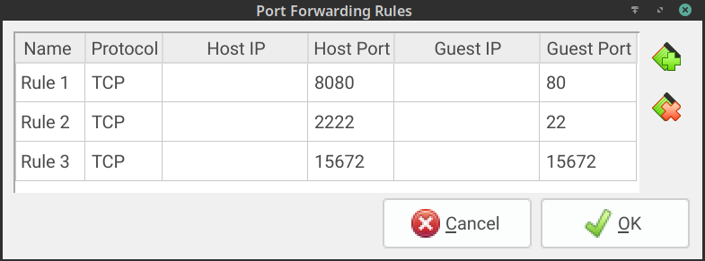
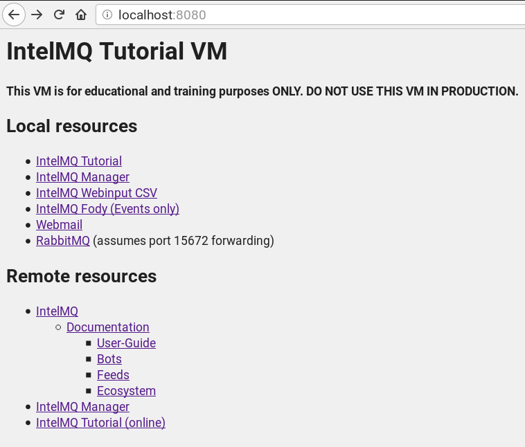
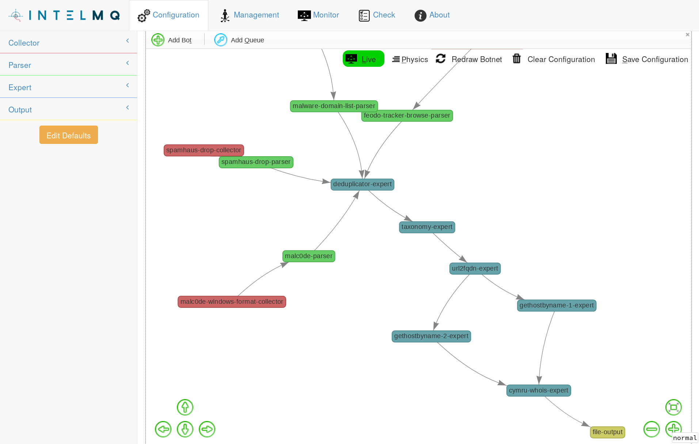
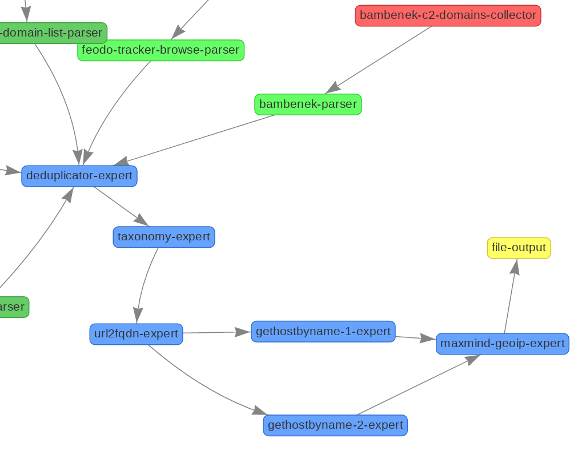

# Lesson 2: Getting started


## Familiarization with the VM: makeing sure it works

Before we start, we need to make sure everything works.

* How to read the tutorial web page on the VM
* Does the internet connection work in the VM?
* How to reset the VM in case something goes wrong?


Concerning access to the VM from your host system: this depends on how you configured your VirtualBox VM. The default network setup in VirtualBox is "NAT". Meaning, your VM is NATed to your PC. That means, your PC can reach the VM via port forwarding. The default config in the VM image (.ova) is that we forward the port 8080 on your PC/laptop to the VM port 80. See the screenshot below.



This being said, your setup might be slightly different (you might have decided to bridge and the VM received an IP address via DHCP. Please check the IP address inside of your VM in this case).

We now assume, you followed the default approach of the VM and used the portforwarding localhost:8080 -> VM:80 approach.
Now go to [http://localhost:8080/](http://localhost:8080/).

You should see a small website like: 



Next, we need to make sure, that the VM can download data from the Internet.
Please execute a `ping 8.8.8.8` or similar and make sure that DNS resolving works:

```bash
ping www.google.com
```

And finally, if you get lost, the VM can be reset so that you have a clear baseline to start from.
You can either create a [snaptshot of the VM now](https://www.virtualbox.org/manual/ch01.html#snapshots), or you can call the `reset-intelmq.sh` script from within the VM's command line (after starting the script, no IntelMQ process should be running anymore, so you might have to restart the processes again if needed).

## Update

Before starting with the tutorial, apply some updates to the VM:

```bash
> tutorial-update.sh
> ./intelmq-tutorial/update-vm.sh
```

## Familiarization - where can I find what? A short walk-through the directory structure

After making sure that we can reach the VM from the host (your PC or laptop), we can take a look at the VM's setup.

But first let us say that the documentation is pretty solid by now. So if you feel lost - apart from this tutorial, you can find 
the documenation [here](https://github.com/certtools/intelmq/blob/master/docs/User-Guide.md) and the [Developers Guide here](https://github.com/certtools/intelmq/blob/master/docs/Developers-Guide.md)

### The directory structure and command line tools

IntelMQ knows multiple ways of getting installed: .deb packages, .rpm, or via pip or via git clone. Also, we distinguish between a production installation and a development installation.

In our case, a development installation has been chosen as installation method so that all IntelMQ-installation related files can be found in `/opt/intelmq` for a better overview (if you had a Debian default install, config files would end up in /etc/intelmq/, etc.).

Directory layout:

* `/opt/intelmq/`: The base location for all IntelMQ core-related files.
* `/opt/intelmq/etc/`: The configuration files.
* `/opt/intelmq/var/lib/`: Data of IntelMQ and it's bots:
* `/opt/intelmq/var/lib/bots/`: For example configuration files of certain bots, local lookup data and output files.
* `/opt/intelmq/var/log/`: The log files and dumped data.
* `/opt/intelmq/var/run/`: The internal PID-files.

### Working on the shell

IntelMQ uses it's own unprivileged user `intelmq`. Always work as this user, otherwise you might screw up some file permissions!

To change the user, for example run:
```bash
sudo -iu intelmq
```


#### Task: Log file location

Where can I find the log files?

<details>
  <summary>Click to see the answer.</summary>
In `/opt/intelmq/var/log`
</details>


### intelmqctl

IntelMQ comes with a command line tool, called `intelmqctl`. It is the work-horse for interacting with IntelMQ. Therefore, we would like to make you familiar with it first. As in many other command line tool (compare for example the `apache2ctl` tool), these commands are provided:

* `intelmqctl start`
* `intelmqctl stop`
* `intelmqctl status`
* `intelmqctl reload`: schedules re-reading and applying configuration without stopping
* `intelmqctl restart`

These commands take a `bot-id` as optional parameter. If not given, the command is applied to all configured bots.

Other important commands:

* `intelmqctl list queues`: Show configured queues and their sizes.
* `intelmqctl check`: Runs some self-check on IntelMQ and supported bots.
* `intelmqctl clear`: Clears the queue given as parameter.
* `intelmqctl log`: Shows the last lines of the bot given as paramter.

The following commands will be described later:
* `intelmqctl enable`
* `intelmqctl disable`

You can get help with `intelmqctl -h` or `intelmqctl --help`, also available for sub-commands. Most subcommands also have auto-completion.

A complete list of  available commands can be found in the [intelmqctl documentation](https://github.com/certtools/intelmq/blob/master/docs/intelmqctl.md)

## Default configuration

This tutorial (and in fact every default installation of IntelMQ) comes with a very basic default configuration: some basic bots and public feeds. By *configuration* we mean:

* all *runtime parameters* (c.f. `etc/runtime.conf`) for all bots (for example API-keys, database names, database users, mail server address, etc.) 
* the *pipeline* configuration (c.f. `etc/pipeline.conf`) which describes which bot is connected to which other bot
* default settings (`etc/defaults.conf`) which should apply to all bots.

In our case, the config consists of:

* 4 collectors and their respective parsers with public feeds.
* Some experts providing de-duplication and basic lookups, including a round-robin "load-balanced" bot.
* A file output bot writing to `/opt/intelmq/var/lib/bots/file-output/events.txt`.

In the beginning of the tutorial we will work with this configuration, afterwards we will set up our own workflows and add new bots and connections (pipelines).

### Task: Start a collector and look at it's log

Start the `spamhaus-drop-collector` and verify in the logs that it successfully collected the feed. Then stop the bot again.

<details>
    <summary>Click to see the answer.</summary>
The bot-id for the  `spamhaus-drop-collector` is... you might have guess it...  `spamhaus-drop-collector`.

* Here is how you start it: `intelmqctl start spamhaus-drop-collector`
* Here is how you look at its logs:
  * `intelmqctl log spamhaus-drop-collector` or (even simpler) `cd /opt/intelmq; less var/log/spamhaus-drop-collector.log`  should show you the log file:
```
2020-01-24T11:15:39.023000 - spamhaus-drop-collector - INFO - HTTPCollectorBot initialized with id spamhaus-drop-collector and intelmq 2.1.1 and python 3.7.3 (default, Apr  3 2019, 05:39:12) as process 6950.
2020-01-24T11:15:39.023000 - spamhaus-drop-collector - INFO - Bot is starting.
2020-01-24T11:15:39.024000 - spamhaus-drop-collector - INFO - Bot initialization completed.
2020-01-24T11:15:39.024000 - spamhaus-drop-collector - INFO - Downloading report from 'https://www.spamhaus.org/drop/drop.txt'.
2020-01-24T11:15:39.147000 - spamhaus-drop-collector - INFO - Report downloaded.
2020-01-24T11:15:39.151000 - spamhaus-drop-collector - INFO - Idling for 3600.0s (1h) now.
```

(note that your output might vary slightly).

You can see that the INFO log level shows information on startup, the fetched URL and that the bots is then sleeping for one hour.

* Stopping the bot: `intelmqctl stop spamhaus-drop-collector`
</details>

### If something went wrong

This bot already downloads data from the Internet. If your internet connection does not work (ping www.google.com), then it can't download anything. 

### Lookup how many events are in the queue for a bot.

Every bot talks with other bots via **queues**. Queues are basically message queues in a MQ system (by default, IntelMQ uses Redis as MQ system). Messages are basically log lines which should get processed.

Next, we would like to start the `spamhaus-drop-collector` again and look up how many events are waiting to be processed in the queue of the next bot (the `deduplicator-expert` in our initial configuration).

<details>
    <summary>Click to see the answer.</summary>
* `intelmqctl start spamhaus-drop-parser`
* `intelmqctl list queues -q`   # shows all non-empty queues:
```
deduplicator-expert-queue - 807
```
(your output might vary slightly).
</details>

## Simple input and output bots

So far, we can start and stop bots and check in their respective log files, if they did anything. We can also check how many messages are waiting in which queue. You will need these steps over and over again, especially if something breaks. The log files are your friend! Use them :)

Next, we will collect real abuse.ch data from the internet, parse it and send the output to a file.


### Task: connect the abuse.ch_feodo collector bot with a file output bot and look at the output

Our default configuration has a number of bots which need to get started in order to have a full pipeline path between the abuse.ch_feodo collector and the file output bot. You can see the pipeline which is configured by default in two ways:

  1. via the `etc/pipeline.conf` file
  2. via the IntelMQ manager. 

We will look at the manager in a minute.

First, please look at the the `etc/pipeline.conf` and identify the path the events are taking between the feodo collector and the ouput. Start each bot individually and observe the message queues and the status.

Next, check if the feodo collector indeed fetched all the data, passed it through the "botnet" and sent it to the file-output bot, which in turn wrote it to disk.

<details>
    <summary>Click to see the answer.</summary>
* `intelmqctl start feodo-tracker-browse-collector`
* `intelmqctl start feodo-tracker-browse-parser`
* `intelmqctl start deduplicator-expert`
* `intelmqctl start taxonomy-expert`
* `intelmqctl start url2fqdn-expert`
* `intelmqctl start gethostbyname-1-expert`
* `intelmqctl start gethostbyname-2-expert`
* `intelmqctl start cymru-whois-expert`
* `intelmqctl start file-output`

Make sure the bots are indeed running and that they fetched something from the Internet and parsed it:

* `intelmqctl status`
* `cat /opt/intelmq/var/log/*feodo*.log`
```
2020-01-27 12:30:54,901 - feodo-tracker-browse-collector - INFO - HTTPCollectorBot initialized with id feodo-tracker-browse-collector and intelmq 2.1.1 and python 3.7.3 (default, Apr  3 2019, 05:39:12) as process 9223.
2020-01-27 12:30:54,903 - feodo-tracker-browse-collector - INFO - Bot is starting.
2020-01-27 12:30:54,903 - feodo-tracker-browse-collector - INFO - Bot initialization completed.
2020-01-27 12:30:54,904 - feodo-tracker-browse-collector - INFO - Downloading report from 'https://feodotracker.abuse.ch/browse'.
2020-01-27 12:30:55,729 - feodo-tracker-browse-collector - INFO - Report downloaded.
2020-01-27 12:30:55,801 - feodo-tracker-browse-collector - INFO - Idling for 86400.0s (1d) now.
```
```
2020-01-27 12:31:00,989 - feodo-tracker-browse-parser - INFO - HTMLTableParserBot initialized with id feodo-tracker-browse-parser and intelmq 2.1.2.alpha.1 and python 3.7.3 (default, Apr  3 2019, 05:39:12) as process 9265.
2020-01-27 12:31:00,990 - feodo-tracker-browse-parser - INFO - Bot is starting.
2020-01-27 12:31:00,990 - feodo-tracker-browse-parser - INFO - Bot initialization completed.
2020-01-27 12:31:09,397 - feodo-tracker-browse-parser - INFO - Processed 500 messages since last logging.
...
2020-01-27 12:31:21,869 - feodo-tracker-browse-parser - INFO - Processed 500 messages since last logging.
```


And finally, we would like to take a look at its output: the output bot (which is by default the place where all events are sent to in our initial configuration) should show you the feodo events:

* `cat /opt/intelmq/var/lib/bots/file-output/events.txt`
Output:
```
{"classification.taxonomy": "malicious code", "classification.type": "c2server", "feed.accuracy": 100.0, "feed.name": "Feodo Tracker Browse", "feed.provider": "Abuse.ch", "feed.url": "https://feodotracker.abuse.ch/browse", "malware.name": "heodo", "raw": "PHRyPjx0ZD4yMDE5LTEyLTEyIDAzOjM3OjMzPC90ZD48dGQ+PGEgaHJlZj0iL2Jyb3dzZS9ob3N0LzEyMC41MS44My44OS8iIHRhcmdldD0iX3BhcmVudCIgdGl0bGU9IkdldCBtb3JlIGluZm9ybWF0aW9uIGFib3V0IHRoaXMgYm90bmV0IEMmYW1wO0MiPjEyMC41MS44My44OTwvYT48L3RkPjx0ZD48c3BhbiBjbGFzcz0iYmFkZ2UgYmFkZ2UtaW5mbyI+SGVvZG8gPGEgY2xhc3M9Im1hbHBlZGlhIiBocmVmPSJodHRwczovL21hbHBlZGlhLmNhYWQuZmtpZS5mcmF1bmhvZmVyLmRlL2RldGFpbHMvd2luLmVtb3RldCIgdGFyZ2V0PSJfYmxhbmsiIHRpdGxlPSJNYWxwZWRpYTogRW1vdGV0IChha2EgR2VvZG8gYWthIEhlb2RvKSI+PC9hPjwvc3Bhbj48L3RkPjx0ZD48c3BhbiBjbGFzcz0iYmFkZ2UgYmFkZ2Utc3VjY2VzcyI+T2ZmbGluZTwvc3Bhbj48L3RkPjx0ZD5Ob3QgbGlzdGVkPC90ZD48dGQgY2xhc3M9InRleHQtdHJ1bmNhdGUiPkFTMjUxOSBWRUNUQU5UIEFSVEVSSUEgTmV0d29ya3MgQ29ycG9yYXRpb248L3RkPjx0ZD48aW1nIGFsdD0iLSIgc3JjPSIvaW1hZ2VzL2ZsYWdzL2pwLnBuZyIgdGl0bGU9IkpQIi8+IEpQPC90ZD48L3RyPg==", "source.allocated": "2008-03-20T00:00:00+00:00", "source.as_name": "VECTANT ARTERIA Networks Corporation, JP", "source.asn": 2519, "source.geolocation.cc": "JP", "source.ip": "120.51.83.89", "source.network": "120.51.0.0/16", "source.registry": "APNIC", "status": "Offline", "time.observation": "2020-01-27T11:30:55+00:00", "time.source": "2019-12-12T02:37:33+00:00"}
...
{"classification.taxonomy": "malicious code", "classification.type": "c2server", "feed.accuracy": 100.0, "feed.name": "Feodo Tracker Browse", "feed.provider": "Abuse.ch", "feed.url": "https://feodotracker.abuse.ch/browse", "malware.name": "heodo", "raw": "PHRyPjx0ZD4yMDE5LTEyLTEyIDAzOjMzOjM4PC90ZD48dGQ+PGEgaHJlZj0iL2Jyb3dzZS9ob3N0Lzk2LjIzNC4zOC4xODYvIiB0YXJnZXQ9Il9wYXJlbnQiIHRpdGxlPSJHZXQgbW9yZSBpbmZvcm1hdGlvbiBhYm91dCB0aGlzIGJvdG5ldCBDJmFtcDtDIj45Ni4yMzQuMzguMTg2PC9hPjwvdGQ+PHRkPjxzcGFuIGNsYXNzPSJiYWRnZSBiYWRnZS1pbmZvIj5IZW9kbyA8YSBjbGFzcz0ibWFscGVkaWEiIGhyZWY9Imh0dHBzOi8vbWFscGVkaWEuY2FhZC5ma2llLmZyYXVuaG9mZXIuZGUvZGV0YWlscy93aW4uZW1vdGV0IiB0YXJnZXQ9Il9ibGFuayIgdGl0bGU9Ik1hbHBlZGlhOiBFbW90ZXQgKGFrYSBHZW9kbyBha2EgSGVvZG8pIj48L2E+PC9zcGFuPjwvdGQ+PHRkPjxzcGFuIGNsYXNzPSJiYWRnZSBiYWRnZS1zdWNjZXNzIj5PZmZsaW5lPC9zcGFuPjwvdGQ+PHRkPk5vdCBsaXN0ZWQ8L3RkPjx0ZCBjbGFzcz0idGV4dC10cnVuY2F0ZSI+QVM3MDEgVVVORVQ8L3RkPjx0ZD48aW1nIGFsdD0iLSIgc3JjPSIvaW1hZ2VzL2ZsYWdzL3VzLnBuZyIgdGl0bGU9IlVTIi8+IFVTPC90ZD48L3RyPg==", "source.allocated": "2006-12-29T00:00:00+00:00", "source.as_name": "UUNET, US", "source.asn": 701, "source.geolocation.cc": "US", "source.ip": "96.234.38.186", "source.network": "96.234.0.0/17", "source.registry": "ARIN", "status": "Offline", "time.observation": "2020-01-27T11:30:55+00:00", "time.source": "2019-12-12T02:33:38+00:00"}
```
</details>

### If something went wrong

This bot already downloads data from the Internet. If your internet connection does not work (ping www.google.com), then it can't download anything. 

Also, if your data does not appear in the output file, please check the message queues if something got stuck. Also check if all bots in the pipeline are indeed running.

### Visualizing everything

You can also go to the graphical interface and observe the pipeline: [http://localhost:8080/manager](http://localhost:8080/manager).




## Input output and filters

Filter on the country code NL


### Task : filter data on country

The Feodo tracker by abuse.ch provides some feeds, the [HTML "feed"](https://feodotracker.abuse.ch/browse/) provides the most information for the C&C server IP addresses including the country and the malware.

Filter the data of the "Feodotracker Browse" feed on country Netherlands (country code "NL") and write the output to `/opt/intelmq/var/lib/bots/file-output/feodo-nl.txt` by adding the filter after the parser and connecting it to a newly created file output bot.

Then (re-)start the collector bot.

<details>
    <summary>Click to see the answer.</summary>

Create a "Filter" expert and filter for `"source.geolocation.cc"` = `"NL"`.

#### Detailed answer

filter expert:
* `filter_key`: `source.geolocation.cc`
* `filter_value`: `NL`
</details>

## Configure a feed:

New feeds can be configured by adding a collector and the matching parser. The [feeds documentation](https://github.com/certtools/intelmq/blob/master/docs/Feeds.md#c2-domains) has a long list of known feeds along with the required configuration parameters. If you know of more feeds, please let us know or [open a pull request](https://github.com/certtools/intelmq/blob/master/docs/Developers-Guide.md#feeds-documentation) to add it!

### Task
Configure the "Bambenek C2 Domains" feed as described [in the documentation](https://github.com/certtools/intelmq/blob/master/docs/Feeds.md#c2-domains).

Stop the Bot `deduplicator-expert` (so we can use the data for the next tasks) and then start the configured collector and parser.

Verify the events were processed by checking the queue size of the bot `deduplicator-expert`.

<details>
    <summary>Click to see the answer.</summary>
Runtime configuration:
```json
    "bambenek-c2-domains-collector": {
        "parameters": {
            "extract_files": false,
            "http_password": null,
            "http_url": "https://osint.bambenekconsulting.com/feeds/c2-dommasterlist.txt",
            "http_url_formatting": false,
            "http_username": null,
            "name": "C2 Domains",
            "provider": "Bambenek",
            "rate_limit": 3600,
            "ssl_client_certificate": null
        },
        "name": "URL Fetcher",
        "group": "Collector",
        "module": "intelmq.bots.collectors.http.collector_http",
        "description": "Generic URL Fetcher is the bot responsible to get the report from an URL.",
        "enabled": true,
        "run_mode": "continuous"
    },
    "bambenek-parser": {
        "parameters": {},
        "name": "Bambenek",
        "group": "Parser",
        "module": "intelmq.bots.parsers.bambenek.parser",
        "description": "Bambenek parser is the bot responsible to parse and and sanitize the information from the feeds available from Bambenek.",
        "enabled": true,
        "run_mode": "continuous"
    }
```
Pipeline configuration:
```json
    "bambenek-c2-domains-collector": {
        "destination-queues": [
            "bambenek-parser-queue"
        ]
    },
    "bambenek-parser": {
        "source-queue": "bambenek-parser-queue",
        "destination-queues": [
            "deduplicator-expert-queue"
        ]
    },
```

* `intelmqctl stop deduplicator-expert`
* `intelmqctl start bambenek-c2-domains-collector` (depending on which ID you gave your new bot)
* `intelmqctl start bambenek-parser` (depending on which ID you gave your new bot)
* `intelmqctl list queues -q`
```
deduplicator-expert-queue - 807
```
(Your output may slightly vary)
</details>

### Understand the deduplicator

#### Task: See how data gets "deduplicated"

Restart a collector which was already running. The file output should not get any new data. Why is this the case and how can you prevent it?

<details>
    <summary>Click to see the answer.</summary>
The deduplicator is configurable. The default works as following:
* Ignores the fields "time.observation" and "raw"
* Hashes the remaining data
* Checks if this hash is already in it's cache
  * If yes, the event is ignored
  * If no, the hash is inserted into the cache with a TTL of one day. The event is forwarded to the next bot.

If the upstream data did not change, the parsed data is the same as before (except for the "time.observation" field).
</details>

#### Task: Bypass the deduplicator

For testing and demo purposes it is helpful to temporarily deactivate this behavior by setting the parameter "bypass" to "true".

<details>
    <summary>Click to see the answer.</summary>
To add this parameter to the runtime configuration in the manager, you need to first click the orange "plus"-sign button in the bot's configuration view to add a new parameter field.
</details>

## Experts: adding information to the stream

The file `/opt/intelmq/var/lib/bots/maxmind_geoip/GeoLite2-City.mmdb` contains the free GeoLite2 database.

### Task: add geoip info to the previous feed

Geolocation information is crucial to determine how to act on received data.
The file `/opt/intelmq/var/lib/bots/maxmind_geoip/GeoLite2-City.mmdb` contains the free GeoLite2 database for fast local lookups.

Add a geolocation lookup bot to your pipeline replacing the `cymru-whois-expert`.
Start all needed bots to see the data in the file.

<details>
    <summary>Click to see the answer.</summary>
The bot is the "MaxMind GeoIP Expert". The only necessary parameter is:
* `database`: `/opt/intelmq/var/lib/bots/maxmind_geoip/GeoLite2-City.mmdb`



* `intelmqctl start deduplicator-expert`
* `intelmqctl start maxmind-geoip-expert` (depending on which ID you gave your new bot)
* `tail /opt/intelmq/var/lib/bots/file-output/events.txt`
```
...
{"classification.taxonomy": "malicious code", "classification.type": "c2server", "event_description.text": "Domain used by virut", "event_description.url": "http://osint.bambenekconsulting.com/manual/virut.txt", "feed.accuracy": 100.0, "feed.name": "C2 Domains", "feed.provider": "Bambenek", "feed.url": "https://osint.bambenekconsulting.com/feeds/c2-dommasterlist.txt", "malware.name": "virut", "raw": "d296dXVwLmNvbSxEb21haW4gdXNlZCBieSB2aXJ1dCwyMDIwLTAxLTI3IDEyOjExLGh0dHA6Ly9vc2ludC5iYW1iZW5la2NvbnN1bHRpbmcuY29tL21hbnVhbC92aXJ1dC50eHQ=", "source.fqdn": "wozuup.com", "source.geolocation.cc": "US", "source.geolocation.city": "San Francisco", "source.geolocation.latitude": 37.7506, "source.geolocation.longitude": -122.4121, "source.ip": "192.0.78.12", "status": "online", "time.observation": "2020-01-27T12:37:55+00:00", "time.source": "2020-01-27T12:11:00+00:00"}
```
As you can see, the data contains several `source.geolocation.*` fields including the country, city and coordinates.
</details>

## Experts: add IP 2 ASN enrichment

The file `/opt/intelmq/var/lib/bots/asn_lookup/ipasn.dat` contains data downloaded and converted by pyasn's utilities.

### Task

Add a ASN lookup bot to your pipeline between your configured Geolocation Expert and the file output. Start the expert. Restart the Bambenek collector to get new data and check the output in the file.

<details>
    <summary>Click to see the answer.</summary>
The bot is the "ASN Lookup" expert. Parameters:
* `database`: `/opt/intelmq/var/lib/bots/asn_lookup/ipasn.dat`
</details>

## The IntelMQ manager

Intro, screenshots, text description. What can it do for you, when is it better to use the cmd line? Etc.

### Task: configure a new feed from local files

Fetch `*.csv` files from `/opt/dev_intelmq/intelmq/tests/bots/parsers/shadowserver/testdata/` and connect it with the Shadowserver parser and this with the deduplicator.
Save the configuration.
Start the both newly added bots.

This requires IntelMQ version 2.1.2.

<details>
    <summary>Click to see the answer.</summary>
Parameters for the "File" collector:
* `delete_file`: `false`
* `path`: `/opt/dev_intelmq/intelmq/tests/bots/parsers/shadowserver/testdata/`
* `postfix`: `.csv`
* `provider`: `Shadowserver`

Parameters for the "ShadowServer" parser:
* `feedname`: not needed, the exact feed will be determined from the file name
* `overwrite`: `true`: this will set the `feed.name` field properly
</details>

# Recap


